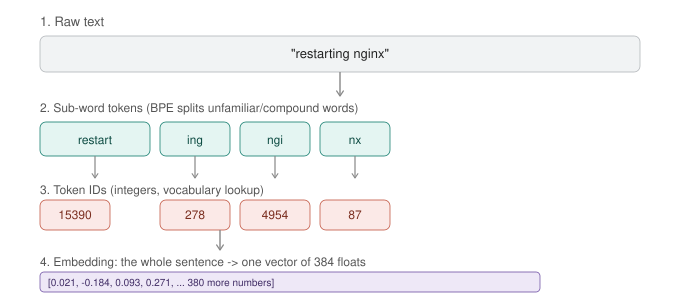

# Day 2 — Tokenization & Embeddings


 
*Raw text gets split into sub-word tokens, each token maps to an integer ID via a vocabulary lookup, and the full sequence collapses into one embedding vector representing the sentence's meaning. Today you'll generate every stage of this yourself.*

**Goal for today:** open up the two things that happen to your text *before* a model ever "thinks" about it — splitting into tokens, and converting into a meaning-vector. By the end you'll be able to explain, with your own generated numbers, why models can't count letters in "strawberry" and how semantic search actually works under the hood.

---

## Part A — Concepts (10 min read)

**Why tokenization exists:** neural networks only operate on numbers. Text has to become numbers somehow. The naive options both fail at scale:
- **Whole-word vocabulary** — every possible word gets an ID. Fails on typos, rare words, made-up words, other languages — infinite vocabulary problem.
- **Character-level** — every letter gets an ID. Works for any text, but sequences become very long (slow, eats context window fast).

**The solution — sub-word tokenization (BPE, Byte-Pair Encoding):** break text into common *chunks* — sometimes whole words, sometimes word pieces, sometimes single characters for rare stuff. Common words like "the" get their own token; rare/compound words like "kubectl" or "nginx" get split into pieces. This is a middle ground that keeps sequences short while still handling any input text.

**Why this explains a famous LLM failure mode:** the "strawberry" letter-counting problem happens because the model never sees individual letters — it sees 2-3 opaque token chunks for that word. Asking it to count letters is like asking you to count the pixels in a word you're reading — the information isn't wrong, it's just not the representation you're operating on.

**Context window, concretely:** every model has a max token count per request (input + output combined) — e.g. 8K, 32K, 128K tokens. This is a hard resource limit, same category as a max payload size on an API gateway. Exceed it and older content gets silently dropped or the request fails, depending on the client.

**Why tokens matter for cost/ops, not just theory:** hosted APIs (OpenAI, Anthropic, etc.) bill per token, not per word or per character. Token counting is the equivalent of estimating compute cost before running a batch job — you'll do this for real in Step 3.

**What an embedding is (recap + extension from the prereq doc):** a fixed-length vector of floats representing the *meaning* of a piece of text. Today's focus is generating and inspecting these directly, at the sentence level, independent of any vector DB — the DB is just where you *store and search* them later.

---

## Part B — Hands-On: Tokenization

### Step 1 — Encode and decode with tiktoken

Purpose: see exactly what a tokenizer does — text in, integers out, and back again.

```python
import tiktoken

enc = tiktoken.get_encoding("cl100k_base")  # the tokenizer family used by GPT-3.5/4-era models

text = "restarting nginx after a failed health check"
tokens = enc.encode(text)

print("Token IDs:", tokens)
print("Token count:", len(tokens))

for t in tokens:
    print(f"{t:6d} -> {repr(enc.decode([t]))}")
```
**What to notice:** common words ("after", "a", "failed") often become single tokens, while less common ones may split into pieces. Run `enc.decode(tokens)` and confirm you get the exact original string back — tokenization is lossless, just a different representation.

### Step 2 — Prove the "strawberry problem" to yourself

```python
for word in ["strawberry", "kubectl", "nginx", "the", "unbelievable"]:
    toks = enc.encode(word)
    pieces = [enc.decode([t]) for t in toks]
    print(f"{word:15s} -> {len(toks)} token(s): {pieces}")
```
**What to expect:** `"the"` is 1 token, `"strawberry"` is likely 2-3 tokens, `"kubectl"` and `"nginx"` (less common in general text, common in your world) may split unexpectedly. This is why domain-specific jargon sometimes tokenizes inefficiently — the base tokenizer's vocabulary was built from general internet text, not your infra vocabulary.

### Step 3 — Practical use case: estimate request cost before sending it

Purpose: this is the real reason engineers check token counts — treat it like estimating the cost of a cloud job before submitting it.

```python
def estimate_cost(text, price_per_1k_tokens=0.0025):
    n_tokens = len(enc.encode(text))
    cost = (n_tokens / 1000) * price_per_1k_tokens
    return n_tokens, cost

runbook = open("docs/runbook.txt").read() if __import__("os").path.exists("docs/runbook.txt") else "Rotate the TLS cert 30 days before expiry."
n, cost = estimate_cost(runbook)
print(f"{n} tokens, ~${cost:.5f} at this rate")
```
Run this against something realistic — a full runbook, a long prompt template, or a big RAG context block — and you have a real pre-flight cost check, the same instinct as `terraform plan` before `apply`.

### Step 4 — Compare tokenizers across model families

Purpose: different model families use different tokenizers, so the *same* text produces *different* token counts and context-window usage depending on which model you target. This matters when picking a model for a cost- or latency-sensitive workload.

```python
from transformers import AutoTokenizer

text = "The HPA will scale replicas when CPU exceeds 80 percent for five minutes."

for model_name in ["gpt2", "bert-base-uncased"]:
    tok = AutoTokenizer.from_pretrained(model_name)
    ids = tok.encode(text)
    print(f"{model_name:20s} -> {len(ids)} tokens")
```
**What to notice:** the token count differs between tokenizers for identical input text. This is why "128K context window" means different actual amounts of *your* text depending on which model's tokenizer is counting.

---

## Part C — Hands-On: Embeddings

### Step 5 — Generate your first embedding and look at the raw vector

```python
from sentence_transformers import SentenceTransformer

model = SentenceTransformer("all-MiniLM-L6-v2")
vec = model.encode("restarting nginx after a failed health check")

print("Shape:", vec.shape)     # (384,)
print("First 10 values:", vec[:10])
print("Min/max:", vec.min(), vec.max())
```
**What to notice:** 384 numbers, each typically small (roughly -1 to 1 range for this model). No single number means anything on its own — the pattern across all 384 encodes the sentence's meaning. This is the same object type a vector DB stores per document, just generated standalone here.

### Step 6 — Batch-embed a realistic set of devops sentences

```python
sentences = [
    "Restart the nginx service if health checks fail.",
    "Bounce nginx after repeated probe failures.",
    "Scale up pod replicas when CPU usage is high.",
    "Increase the number of replicas under heavy load.",
    "Rotate the TLS certificate before it expires.",
    "Renew the cert-manager certificate ahead of expiry.",
    "Deploy the new build to the staging environment.",
]

vecs = model.encode(sentences)
print(vecs.shape)   # (7, 384) - 7 sentences, 384 dims each
```

### Step 7 — Compute a full similarity matrix and read it like a heatmap table

Purpose: this is the computational core of every "semantic search" feature you'll ever build — seeing the whole matrix at once shows *why* it works, not just one query at a time.

```python
from sentence_transformers import util
import numpy as np

sim_matrix = util.cos_sim(vecs, vecs).numpy()

print("     " + " ".join(f"S{i}" for i in range(len(sentences))))
for i, row in enumerate(sim_matrix):
    print(f"S{i}: " + " ".join(f"{v:.2f}" for v in row))
```
**What to notice:** sentences 0-1 (both about nginx restarts) should show high similarity to each other and lower similarity to sentences 4-5 (about certs). The diagonal is always 1.00 (a sentence is identical to itself). This matrix, at scale, is exactly what a vector DB's index is built to search efficiently instead of computing brute-force like this.

### Step 8 — Visualize the clustering (see it, don't just read numbers)

```python
from sklearn.decomposition import PCA
import matplotlib.pyplot as plt

coords = PCA(n_components=2).fit_transform(vecs)
topics = ["nginx", "nginx", "scale", "scale", "cert", "cert", "deploy"]
colors = {"nginx": "tab:green", "scale": "tab:blue", "cert": "tab:red", "deploy": "tab:orange"}

plt.figure(figsize=(6, 5))
for (x, y), topic, s in zip(coords, topics, sentences):
    plt.scatter(x, y, c=colors[topic], s=90)
    plt.annotate(s[:25], (x, y), fontsize=7, xytext=(4, 4), textcoords="offset points")
plt.title("DevOps sentences clustered by meaning")
plt.savefig("day2_embeddings.png", dpi=150, bbox_inches="tight")
print("Saved day2_embeddings.png")
```
Open the PNG — you should see nginx-related, scaling-related, and cert-related sentences forming visibly separate clusters, with "deploy" sitting alone since nothing else relates to it.

### Step 9 — Practical use case: near-duplicate detection (a real ops problem)

Purpose: this is a genuine production use case — flagging near-duplicate incident tickets, log lines, or alerts even when the wording differs, so you don't get paged three times for the same underlying issue phrased differently.

```python
def find_near_duplicates(sentences, threshold=0.75):
    vecs = model.encode(sentences)
    sims = util.cos_sim(vecs, vecs).numpy()
    pairs = []
    for i in range(len(sentences)):
        for j in range(i + 1, len(sentences)):
            if sims[i][j] > threshold:
                pairs.append((sentences[i], sentences[j], sims[i][j]))
    return pairs

tickets = [
    "nginx pod keeps restarting due to failed liveness probe",
    "Liveness probe failing, nginx container restart loop",
    "Database connection pool exhausted under load",
    "TLS cert expired on the ingress controller",
]

for a, b, score in find_near_duplicates(tickets):
    print(f"[{score:.2f}] '{a}'  ~~  '{b}'")
```
**Expected result:** the two nginx/liveness-probe tickets should pair up as near-duplicates despite completely different wording — this is a directly deployable pattern for ticket dedup or alert grouping.

---

## Deliverable

Save to `~/ai-course/day2-notes.md`:

```markdown
# Day 2 Notes

## Tokenization
- "strawberry" tokenized into: ...
- Token count difference between gpt2 and bert tokenizers for the same sentence: ...
- Estimated cost of my runbook.txt: ...

## Embeddings
- Similarity score between the two nginx sentences: ...
- Similarity score between an nginx sentence and a cert sentence: ...
- Near-duplicate pairs found: ...

## One thing that surprised me:
...
```

---

**Tomorrow (Day 3):** transformer architecture — you'll open up *how* the model actually uses these token embeddings to decide what comes next, including a look at real attention weights from a small model.