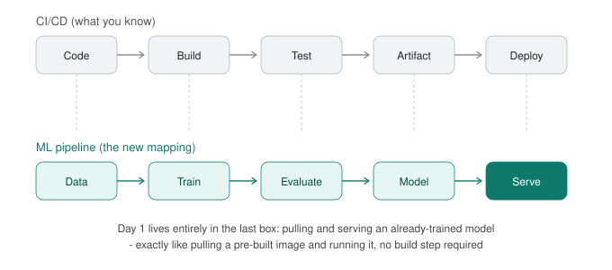

# Day 1 — ML Mental Model + Environment Setup


 
*The ML lifecycle (Data → Train → Evaluate → Model → Serve) maps directly onto your CI/CD pipeline (Code → Build → Test → Artifact → Deploy). Today lives entirely in the last box — pulling and running an already-trained model, no build step of your own.*

**Goal for today:** get every tool installed and verified, understand what a "model" actually is in operational terms, and run your first local LLMs — enough to compare sizes/latency/quality like you would benchmark two service versions.

---

## Part A — Concepts (15-20 min read)

**What a model actually is, operationally:** a model is a big file of numbers (weights) plus a config describing how to combine them. "Training" produced that file once, offline. "Inference" is just running your input through that fixed math — no learning happens at inference time, despite how conversational it feels. This matters operationally: a model in production is *read-only*, like a compiled binary. It doesn't change unless you explicitly re-train or fine-tune and ship a new version.

**Training vs inference, mapped to what you know:**
| ML term | Devops equivalent |
|---|---|
| Training | The build pipeline — expensive, run rarely, produces an artifact |
| Inference | Running the built artifact — cheap per-call, run constantly |
| Weights/checkpoint | The compiled binary / built image |
| Fine-tuning | A patch release built on top of a base image |

**Parameters:** the count of individual numbers in the weights file (e.g. "7B" = 7 billion numbers). Roughly: more parameters → more capability, but also more RAM/compute and slower inference. This is a direct capacity-vs-cost tradeoff, same shape as choosing a bigger EC2 instance for a heavier workload.

**Tokens:** models don't read letters or whole words — text gets split into sub-word chunks called tokens (e.g. "unbelievable" might become `un` + `believ` + `able`). Every model has a **context window** — a hard cap on how many tokens (input + output combined) it can handle per request. Think of it as a fixed request-payload size limit, similar to a max request body size on a load balancer — exceed it and things get truncated or rejected.

**Why GPUs/Metal matter:** inference is mostly matrix multiplication, which is embarrassingly parallel. CPUs do this serially-ish; GPUs (and Apple's Metal/Neural Engine) do thousands of these multiplications simultaneously. This is why the same model can feel instant on GPU and painfully slow on CPU — same math, radically different parallelism, same reason you wouldn't run a horizontally-scalable batch job on a single thread.

**The ML lifecycle vs your CI/CD lifecycle (see diagram above):** Data → Train → Evaluate → Model artifact → Serve → Monitor maps directly onto Code → Build → Test → Artifact → Deploy → Monitor. Today you're working entirely in the last box — **Serve** — pulling an already-built artifact and running it, exactly like pulling a pre-built Docker image with no build step of your own.

---

## Part B — Environment Setup

### Step 1 — Core tools

```bash
# Homebrew (skip if already installed)
/bin/bash -c "$(curl -fsSL https://raw.githubusercontent.com/Homebrew/install/HEAD/install.sh)"

# Python via pyenv (keeps this isolated from system Python)
brew install pyenv
pyenv install 3.11.9
pyenv global 3.11.9
echo 'eval "$(pyenv init -)"' >> ~/.zshrc
source ~/.zshrc
python3 --version   # should print 3.11.9
```

### Step 2 — Ollama (your local model runtime)

```bash
brew install ollama
brew services start ollama     # runs as a background service, like starting a daemon

# Verify it's up
curl http://localhost:11434     # should return "Ollama is running"
```

### Step 3 — Python ML packages

```bash
mkdir -p ~/ai-course && cd ~/ai-course
python3 -m venv venv
source venv/bin/activate

pip install --upgrade pip
pip install jupyterlab torch transformers sentence-transformers \
    chromadb langchain langchain-community ollama tiktoken \
    matplotlib scikit-learn
```

### Step 4 — Verify Apple Silicon acceleration (Metal)

Purpose: confirm PyTorch can actually use your GPU cores, not just CPU — this is the difference between "usable" and "painfully slow" for anything beyond today.

```python
import torch
print("MPS (Metal) available:", torch.backends.mps.is_available())
print("MPS built:", torch.backends.mps.is_built())
```

```bash
(venv) muditcse@Mac ai-course % python3 Verify_Apple_Silicon_acceleration_Metal.py 
MPS (Metal) available: True
MPS built: True
(venv) muditcse@Mac ai-course % 
```
**Expected on Apple Silicon:** both `True`. If `False`, you're on Intel Mac or have an old PyTorch build — CPU inference will still work for everything in this course, just slower.

### Step 5 — Optional but recommended: MLX (Apple's native ML framework)

Purpose: MLX is Apple-built specifically for M-series chips and will matter later for fine-tuning (Day 12). Install now so it's ready.

```bash
pip install mlx mlx-lm
python3 -c "import mlx.core as mx; print(mx.default_device())"
```

---

## Part C — Hands-On: Run and Compare Local Models

### Step 6 — Pull your first models

```bash
ollama pull llama3.2      # ~2GB, 3B params - small/fast
ollama pull phi3          # ~2.3GB, 3.8B params - Microsoft's small model
ollama pull llama3.1:8b   # ~4.7GB, 8B params - noticeably more capable, slower
```
While these download, note the sizes on disk — that's your first hands-on encounter with the capability-vs-resource tradeoff from Part A.

### Step 7 — Run each one interactively

```bash
ollama run llama3.2
```
Ask it something like: *"Explain what a Kubernetes readiness probe does, in 2 sentences."* Then `/bye` to exit, and repeat with `phi3` and `llama3.1:8b`, asking the exact same question each time.

**What to notice:** response speed (does 8B feel noticeably slower to start streaming?) and answer quality/depth (does 8B give a more precise or more caveated answer?).

### Step 8 — Benchmark it properly instead of just eyeballing it

Purpose: turn "it felt slower" into an actual number — this is the muscle memory you already have from load-testing services, just pointed at a model instead.

```python
import ollama
import time

models = ["llama3.2", "phi3", "llama3.1:8b"]
prompt = "Explain what a Kubernetes readiness probe does, in 2 sentences."

for m in models:
    start = time.time()
    response = ollama.chat(model=m, messages=[{"role": "user", "content": prompt}])
    elapsed = time.time() - start
    tokens = len(response["message"]["content"].split())
    print(f"{m:15s} | {elapsed:5.2f}s | ~{tokens} words | ~{tokens/elapsed:.1f} words/sec")
    print(f"   -> {response['message']['content'][:100]}...\n")
```

### Step 9 — Inspect what "running a model" actually spun up

Purpose: connect this back to the registry/artifact mental model from the prereq doc — nothing here is magic, it's a served artifact.

```bash
ollama list                 # every pulled model = a versioned artifact, like `docker images`
ollama ps                   # currently loaded-in-memory models, like `docker ps`
curl http://localhost:11434/api/tags   # the raw registry API response, JSON
```

---

## Deliverable

Save the benchmark output from Step 8 as a short markdown note, e.g. `~/ai-course/day1-notes.md`:

```markdown
# Day 1 Benchmark Notes

| Model | Params | Time (s) | Words/sec | Notes |
|---|---|---|---|---|
| llama3.2 | 3B | ... | ... | ... |
| phi3 | 3.8B | ... | ... | ... |
| llama3.1:8b | 8B | ... | ... | ... |

Observations:
- ...
```

This is your first artifact for the course — a real benchmark report, same shape as any perf-testing writeup you'd produce at work.

---

**Tomorrow (Day 2):** tokenization and embeddings — you'll open up what actually happens to your prompt text before it ever reaches the model's math.
