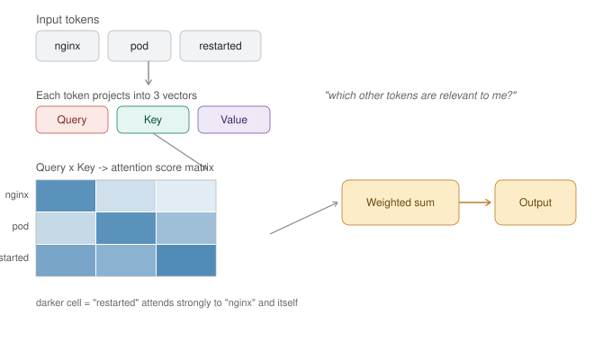

# Day 3 — Transformer Architecture (Conceptual + Code Peek)



*Each token projects into a Query, Key, and Value vector. Queries compare against all Keys to produce an attention score matrix (darker = stronger attention), which then weights the Values to produce each token's output. Today you'll pull these exact matrices out of a real model and look at them.*

**Goal for today:** understand self-attention well enough to explain it in one breath, then prove it by extracting and visualizing real attention weights from a running model — no more taking "the transformer pays attention to relevant words" on faith.

---

## Part A — Concepts (15 min read)

**The core idea, in devops terms:** self-attention is each token asking "which other tokens in this sequence matter to me right now?" and getting back a weighted blend of them. Concretely:
- **Query (Q)** — what this token is looking for
- **Key (K)** — what each token (including itself) advertises about itself
- **Value (V)** — the actual content each token contributes if selected

The token's Query gets compared against every token's Key (a dot product), producing a **score** per pair. Scores get normalized (softmax) into weights that sum to 1, then those weights blend the Values together. This is directly analogous to a **weighted service-discovery lookup**: your request (Query) gets scored against every registered service's advertised capability (Key), and the response is a weighted blend of what those services return (Value) — nothing exotic, just a soft, differentiable version of "find the best match(es)."

**Multi-head attention:** instead of doing this once, the model does it many times in parallel with different learned projections ("heads") — e.g. one head might specialize in tracking grammatical subject-verb pairs, another in tracking which pronoun refers to which noun. This is like running several independent scoring functions over the same request and combining their opinions — an ensemble, computed simultaneously.

**Why attention is O(n²):** every token compares against every other token — for a sequence of length n, that's n×n comparisons. Double your input length, quadruple your compute and memory for the attention step. This is the direct mathematical reason long-context models are expensive and why "just increase the context window" isn't free — it's the same shape of problem as an all-pairs mesh network where connections grow quadratically with node count, not linearly.

**Causal (decoder) vs bidirectional (encoder) attention:**
- **Causal / autoregressive (GPT-style):** each token can only attend to itself and earlier tokens — never future ones, because the model generates left-to-right, one token at a time, and can't peek at what it hasn't generated yet. Enforced with a **mask** that zeroes out (or sets to -infinity before softmax) any attention score pointing to a future position. This is like an append-only log — you can read everything written so far, never anything not yet committed.
- **Bidirectional (BERT-style):** every token can attend to every other token, past and future, because the whole input is already known upfront (useful for classification/understanding tasks, not text generation).

**Encoder vs decoder, the practical distinction:** encoders (BERT-family) are built for *understanding* a fixed input (classification, embeddings — this is literally what powered your embedding model in Day 2). Decoders (GPT-family, and basically every chat model you've used) are built for *generating* text one token at a time. Most LLMs you interact with day-to-day are decoder-only.

---

## Part B — Hands-On: Inspect a Real Model's Architecture

### Step 1 — Load a small model and print its actual config

Purpose: stop treating "the model" as a black box — see the literal numbers that define its shape.

```python
from transformers import AutoModel, AutoConfig, AutoTokenizer

model_name = "gpt2"  # small (124M params), runs fine on CPU, decoder-only
config = AutoConfig.from_pretrained(model_name)
model = AutoModel.from_pretrained(model_name, output_attentions=True)
tokenizer = AutoTokenizer.from_pretrained(model_name)

print("Layers:", config.n_layer)
print("Attention heads per layer:", config.n_head)
print("Hidden size (embedding dim):", config.n_embd)
print("Vocab size:", config.vocab_size)
print("Max context length:", config.n_ctx)
print("Total attention operations per forward pass:", config.n_layer * config.n_head)
```
**What to notice:** GPT-2 small has 12 layers × 12 heads = 144 separate attention computations happening per forward pass, each potentially specializing in a different pattern. This single print statement replaces a lot of hand-wavy "transformers have layers and attention" explanation with actual numbers.

### Step 2 — Run a real sentence through the model and pull out attention weights

Purpose: this is the moment the diagram above stops being an illustration and becomes real numbers you generated yourself.

```python
import torch

text = "The nginx pod restarted because it failed"
inputs = tokenizer(text, return_tensors="pt")

with torch.no_grad():
    outputs = model(**inputs)

attentions = outputs.attentions  # tuple of (num_layers) tensors, each shaped [batch, heads, seq_len, seq_len]
print("Number of layers with attention:", len(attentions))
print("Shape of layer 0 attention:", attentions[0].shape)

tokens = tokenizer.convert_ids_to_tokens(inputs["input_ids"][0])
print("Tokens:", tokens)
```
**What to notice:** the shape `[1, 12, 8, 8]` (batch=1, 12 heads, 8 tokens, 8 tokens) means you have a full 8×8 attention score matrix *per head, per layer* — exactly the matrix shape in the diagram, just 144 of them instead of 1.

### Step 3 — Visualize one head's attention as a heatmap

Purpose: see, don't just print, which tokens the model is actually attending to for this sentence.

```python
import matplotlib.pyplot as plt
import numpy as np

layer, head = 5, 3  # pick a middle layer, arbitrary head to start
attn_matrix = attentions[layer][0, head].numpy()

fig, ax = plt.subplots(figsize=(6, 6))
im = ax.imshow(attn_matrix, cmap="Blues")
ax.set_xticks(range(len(tokens)))
ax.set_yticks(range(len(tokens)))
ax.set_xticklabels(tokens, rotation=45, ha="right")
ax.set_yticklabels(tokens)
ax.set_xlabel("Key (attended TO)")
ax.set_ylabel("Query (attending FROM)")
ax.set_title(f"Layer {layer}, Head {head} attention")
plt.colorbar(im)
plt.tight_layout()
plt.savefig("day3_attention_heatmap.png", dpi=150)
print("Saved day3_attention_heatmap.png")
```
Open the PNG. **What to look for:** read row by row — each row is one token's Query, and the bright cells in that row show which tokens it attended to most. Look specifically at the row for `"it"` — in a well-trained model, you'll often see meaningful weight on `"pod"`, which is the actual referent of "it" in this sentence. That's coreference resolution happening inside a single attention head, visible directly.

### Step 4 — Compare multiple heads to see specialization

Purpose: prove that different heads genuinely learn different patterns, not just noisy duplicates of each other.

```python
fig, axes = plt.subplots(2, 3, figsize=(15, 10))
heads_to_show = [0, 3, 6, 9, 10, 11]

for ax, head in zip(axes.flat, heads_to_show):
    attn_matrix = attentions[layer][0, head].numpy()
    ax.imshow(attn_matrix, cmap="Blues")
    ax.set_xticks(range(len(tokens)))
    ax.set_yticks(range(len(tokens)))
    ax.set_xticklabels(tokens, rotation=45, ha="right", fontsize=7)
    ax.set_yticklabels(tokens, fontsize=7)
    ax.set_title(f"Head {head}")

plt.tight_layout()
plt.savefig("day3_multi_head_comparison.png", dpi=150)
print("Saved day3_multi_head_comparison.png")
```
**What to notice:** some heads look almost diagonal (each token mostly attends to itself/nearby tokens — local pattern), others show strong off-diagonal bands (long-range dependencies like the "it" → "pod" link). This is the concrete evidence behind "multi-head attention captures different relationship types."

### Step 5 — See the causal mask directly (why GPT can't cheat by looking ahead)

Purpose: turn the abstract "causal masking" concept into a picture of a literal triangular matrix.

```python
import matplotlib.pyplot as plt

seq_len = len(tokens)
causal_mask = torch.tril(torch.ones(seq_len, seq_len))

plt.figure(figsize=(5, 5))
plt.imshow(causal_mask, cmap="Greys")
plt.xticks(range(seq_len), tokens, rotation=45, ha="right")
plt.yticks(range(seq_len), tokens)
plt.title("Causal mask: white = allowed to attend, black = blocked (future)")
plt.tight_layout()
plt.savefig("day3_causal_mask.png", dpi=150)
print("Saved day3_causal_mask.png")
```
**What to notice:** a lower-triangular matrix — every token can see itself and everything before it (white), nothing after it (black). Compare this shape to the attention heatmap from Step 3 — GPT-2's actual attention weights will only ever be nonzero in this same triangular region, because the mask is applied before the softmax during every forward pass. This *is* the mechanism, not a metaphor for it.

### Step 6 — Practical use case: use attention as a debugging signal

Purpose: this is a genuine, real-world application of what you just visualized — using attention weights to sanity-check *why* a model produced a particular output, similar to reading a trace to understand why a request took a certain path.

```python
def what_does_token_attend_to(text, target_token, layer=6, head=0, top_k=3):
    inputs = tokenizer(text, return_tensors="pt")
    with torch.no_grad():
        outputs = model(**inputs)
    tokens = tokenizer.convert_ids_to_tokens(inputs["input_ids"][0])

    if target_token not in tokens:
        print(f"'{target_token}' not found in tokens: {tokens}")
        return

    idx = tokens.index(target_token)
    attn_row = outputs.attentions[layer][0, head, idx].numpy()
    top_indices = attn_row.argsort()[-top_k:][::-1]

    print(f"Token '{target_token}' attends most to:")
    for i in top_indices:
        print(f"  {tokens[i]:15s} weight={attn_row[i]:.3f}")

what_does_token_attend_to("The nginx pod restarted because it failed", "Ġit", layer=6, head=2)
```
**Note:** GPT-2's tokenizer prefixes tokens with `Ġ` to mark "preceded by a space" — print `tokens` from Step 2 first to get the exact string to search for. This pattern — inspecting what a specific token attended to — is exactly what interpretability tooling in production LLM systems does when debugging unexpected outputs.

### Step 7 — Feel the O(n²) cost directly

Purpose: turn "attention is quadratic" from a fact you're told into a curve you generate and watch bend.

```python
import time

lengths = [8, 16, 32, 64, 128, 256]
times = []

base_text = "The nginx pod restarted because it failed the health check and needed manual intervention. " * 10

for length in lengths:
    inputs = tokenizer(base_text, return_tensors="pt", truncation=True, max_length=length)
    start = time.time()
    with torch.no_grad():
        model(**inputs)
    times.append(time.time() - start)
    print(f"seq_len={length:4d} -> {times[-1]:.4f}s")

import matplotlib.pyplot as plt
plt.plot(lengths, times, marker="o")
plt.xlabel("Sequence length (tokens)")
plt.ylabel("Forward pass time (s)")
plt.title("Attention cost grows faster than linearly with sequence length")
plt.savefig("day3_quadratic_cost.png", dpi=150)
print("Saved day3_quadratic_cost.png")
```
**What to notice:** the curve bends upward, not a straight line — doubling sequence length more than doubles compute time. This is the direct, felt reason why a "128K context" API call costs disproportionately more than an 8K one, and why techniques like KV-caching, sliding-window attention, and flash-attention exist purely to fight this cost curve — worth knowing the names exist, not worth deep-diving today.

---

## Deliverable

Save to `~/ai-course/day3-notes.md`:

```markdown
# Day 3 Notes

## Architecture inspected (gpt2)
- Layers: ...
- Heads per layer: ...
- Total attention ops per forward pass: ...

## Attention heatmap observations
- Which token did "it" attend to most strongly? ...
- Did different heads show different specialization? ...

## Causal mask
- One sentence describing what the triangular shape means: ...

## Quadratic cost
- Forward pass time at seq_len=8 vs seq_len=256: ...
- One implication this has for how I'd design a RAG context window: ...
```

---

**Tomorrow (Day 4):** running LLMs locally like a sysadmin — quantization, GGUF vs safetensors, custom Modelfiles, and treating a served model's latency/throughput like an SLI you'd actually monitor.
