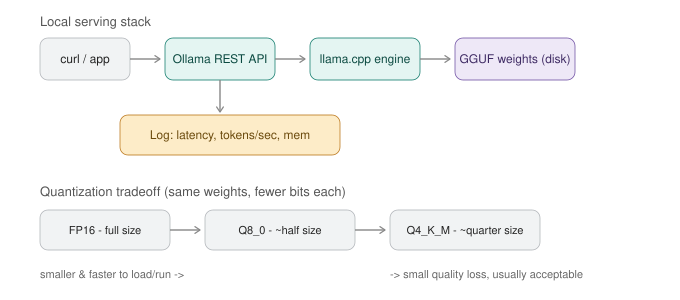

# Day 4 — Running LLMs Locally Like a Sysadmin



*A request travels client → Ollama's REST API → the llama.cpp engine → quantized GGUF weights on disk, with latency/throughput logged along the way. Lower-bit quantization (top: FP16 → Q8 → Q4) trades a little quality for a lot less size and faster inference. Today you'll benchmark that tradeoff yourself and stand up basic monitoring around a served model.*

**Goal for today:** stop treating "running a local LLM" as a magic `ollama run` command. Understand what quantization actually is, inspect the real files on disk, hit the model over its REST API like any other service, and build the beginnings of an observability habit around it — latency and throughput as SLIs, not vibes.

---

## Part A — Concepts (15 min read)

**Quantization, plainly:** model weights are normally stored as 16-bit or 32-bit floating point numbers. Quantization reduces the precision each weight is stored at — down to 8-bit, or even 4-bit integers — which shrinks the file size and speeds up inference (less data to move and multiply), at a small cost to output quality. This is directly analogous to lossy compression: an MP3 isn't a perfect copy of the WAV, but it's close enough for the vast majority of listening, at a fraction of the size. A **Q4** model isn't a perfect copy of the full-precision model, but it's close enough for most tasks at roughly a quarter of the size.

**Reading quantization names (you'll see these constantly):**
- `FP16` — full 16-bit precision, largest, highest fidelity
- `Q8_0` — 8-bit, roughly half the size of FP16, very close quality
- `Q4_K_M` — 4-bit with a smarter mixed-precision scheme ("K_M" = a specific quantization method that keeps some layers higher-precision), a common "good default" — small and fast with acceptable quality loss
- `Q2` — 2-bit, very small, noticeably degraded quality — rarely worth it except for extreme resource constraints

**Model formats — safetensors vs GGUF:** `safetensors` is the standard Hugging Face/PyTorch storage format — a safe (no arbitrary code execution, unlike old `.bin`/pickle files), straightforward tensor container, used mainly for training and Python-based inference. `GGUF` is llama.cpp's own single-file format, purpose-built for fast local inference: it bundles the quantized weights, tokenizer, and architecture metadata into one file that can be memory-mapped (loaded lazily, not read fully into RAM upfront). This is the same distinction as a raw build artifact (safetensors, needs a Python runtime and know-how to load correctly) versus a self-contained deployable package (GGUF, one file, one runtime, run it anywhere llama.cpp runs) — GGUF is what Ollama pulls and runs under the hood.

**llama.cpp, in one sentence:** a dependency-free C++ inference engine that runs GGUF models efficiently on CPU and Apple's Metal, which is exactly what Ollama wraps with a friendlier CLI/API on top — same relationship as `dockerd` (the engine) to `docker` (the CLI you actually type).

**Resource limits, concretely:**
- **RAM needed ≈ the model's file size on disk** (quantized) plus overhead for the active context — a 4GB Q4 model needs roughly 4-6GB of available RAM to run comfortably.
- **Context length affects memory too** — every token in the context window has an associated KV-cache entry (cached Key/Value vectors from Day 3's attention mechanism) that grows with context length, so longer conversations use more RAM even with the same model.
- **Concurrent requests degrade throughput** — same as any single-process service, more simultaneous requests than the hardware can parallelize means queuing, not free scaling. You'll measure this directly in Step 5.

---

## Part B — Hands-On

### Step 1 — Revisit and formalize the registry/artifact view from Day 1

```bash
ollama list                 # every pulled model, with size on disk
ollama ps                   # currently loaded-in-memory models
ollama show llama3.2        # full manifest: parameters, template, quantization level
ollama show llama3.2 --modelfile   # the actual Modelfile that produced this build
```
**What to look for in `ollama show`:** it reports the quantization level directly (e.g. `Q4_K_M`) — note it down, you'll compare against a different quantization in Step 3.

### Step 2 — Find and inspect the real GGUF file on disk

Purpose: stop treating the model as an abstraction — see the actual multi-gigabyte file and compute its bits-per-weight yourself.

```bash
# Find the blob (the actual model weights file, content-addressed by SHA)
ls -la ~/.ollama/models/blobs/ | sort -k5 -n -r | head -5

# Pick the largest blob (that's your model weights) and check its size
du -h ~/.ollama/models/blobs/sha256-<paste-the-hash-here>
```
```python
# Roughly back out bits-per-weight from file size and known parameter count
file_size_bytes = 2_019_377_696   # replace with your actual blob size in bytes
num_params = 3_000_000_000        # e.g. llama3.2 3B

bits_per_param = (file_size_bytes * 8) / num_params
print(f"~{bits_per_param:.1f} bits per parameter")
```
**What to expect:** a number around 4-5 for a Q4 model, around 8 for Q8, around 16 for FP16 — this single calculation makes "4-bit quantization" a verified fact about the file on your disk, not a marketing label.

### Step 3 — Pull a second quantization level of the same model and compare

Purpose: this is the actual tradeoff from the diagram, measured with your own hardware and your own eyes on the output quality.

```bash
ollama pull llama3.2:3b-instruct-q4_K_M
ollama pull llama3.2:3b-instruct-q8_0
```
```python
import ollama, time

prompt = "Explain what a Kubernetes readiness probe does, in 2 sentences."

for tag in ["llama3.2:3b-instruct-q4_K_M", "llama3.2:3b-instruct-q8_0"]:
    start = time.time()
    resp = ollama.chat(model=tag, messages=[{"role": "user", "content": prompt}])
    elapsed = time.time() - start
    print(f"\n=== {tag} ({elapsed:.2f}s) ===")
    print(resp["message"]["content"])
```
**What to check:** compare speed (Q4 should be faster) and read both answers side by side — for a task this simple, quality differences are often barely noticeable, which is exactly why Q4_K_M is a common production default. For harder reasoning tasks the gap tends to widen — worth testing with a trickier prompt if you're curious.

### Step 4 — Serve the model over its REST API and hit it like any other backend service

Purpose: stop thinking of `ollama run` as the only interface — this is the same API your Python scripts have been calling all along, and treating it explicitly as a service is the mental shift for today.

```bash
# Non-streaming request
curl http://localhost:11434/api/generate -d '{
  "model": "llama3.2",
  "prompt": "Why would a pod be stuck in CrashLoopBackOff?",
  "stream": false
}' | python3 -m json.tool

# Streaming request - watch tokens arrive incrementally, like a log tail
curl http://localhost:11434/api/generate -d '{
  "model": "llama3.2",
  "prompt": "Why would a pod be stuck in CrashLoopBackOff?",
  "stream": true
}'
```
**What to notice in the streaming response:** each line is its own JSON object with one token-chunk and a `done: false/true` flag — this is exactly the pattern behind every "typing" effect you've seen in chat UIs, and it's the same server-sent-events style streaming you'd build for any long-running API response.

### Step 5 — Load-test it like you would any local service

Purpose: prove "concurrent requests degrade throughput" with a number instead of assuming it.

```python
import ollama
import time
import concurrent.futures

def timed_request(i):
    start = time.time()
    ollama.chat(model="llama3.2", messages=[{"role": "user", "content": "Say hello in one word."}])
    return time.time() - start

# Sequential baseline
start = time.time()
for i in range(5):
    timed_request(i)
sequential_total = time.time() - start
print(f"5 sequential requests: {sequential_total:.2f}s total")

# Concurrent (same 5 requests, fired at once)
start = time.time()
with concurrent.futures.ThreadPoolExecutor(max_workers=5) as ex:
    list(ex.map(timed_request, range(5)))
concurrent_total = time.time() - start
print(f"5 concurrent requests: {concurrent_total:.2f}s total")
```
**What to expect:** concurrent total will likely be faster than sequential but nowhere near 5x faster — Ollama serializes or partially parallelizes requests depending on hardware, same shape of bottleneck as a single-instance service without horizontal scaling. This is a capacity-planning fact worth knowing before you build anything that expects to serve multiple users locally.

### Step 6 — Build a minimal monitoring/logging wrapper (your first "LLMOps" script)

Purpose: treat latency and tokens/sec as SLIs you log on every request, the same instinct as instrumenting any other service you own.

```python
import ollama
import time
import json
from datetime import datetime

LOG_FILE = "llm_requests.jsonl"

def monitored_chat(model, prompt):
    start = time.time()
    response = ollama.chat(model=model, messages=[{"role": "user", "content": prompt}])
    elapsed = time.time() - start

    content = response["message"]["content"]
    tokens_out = len(content.split())  # rough proxy, not exact tokenizer count

    log_entry = {
        "timestamp": datetime.now().isoformat(),
        "model": model,
        "prompt_preview": prompt[:50],
        "latency_sec": round(elapsed, 3),
        "tokens_out_approx": tokens_out,
        "tokens_per_sec": round(tokens_out / elapsed, 2) if elapsed > 0 else None,
    }

    with open(LOG_FILE, "a") as f:
        f.write(json.dumps(log_entry) + "\n")

    return content, log_entry

for prompt in [
    "What causes a pod to OOMKill?",
    "Explain the difference between a Deployment and a StatefulSet.",
    "What does 'idempotent' mean in infrastructure automation?",
]:
    _, entry = monitored_chat("llama3.2", prompt)
    print(entry)
```
Run it a few times with different prompts, then inspect the log:
```bash
cat llm_requests.jsonl | python3 -m json.tool 2>/dev/null || cat llm_requests.jsonl
```
**What you now have:** a structured, append-only log of every request's latency and throughput — the exact same shape as request logs you'd already ship to a logging backend at work. This is the seed of real LLM observability; Day 13 later in the course builds directly on this pattern.

### Step 7 — Build a custom Modelfile with real operational parameters

Purpose: treat this like writing a Dockerfile — pinning behavior explicitly instead of relying on defaults.

```bash
cat > Modelfile <<'EOF'
FROM llama3.2
PARAMETER temperature 0.2
PARAMETER num_ctx 4096
PARAMETER stop "</done>"
SYSTEM "You are an on-call assistant. Be concise. Always suggest a next diagnostic step."
EOF

ollama create oncall-bot:v1 -f Modelfile
ollama run oncall-bot:v1
```
**What each parameter does, operationally:**
- `temperature 0.2` — lower randomness, more consistent/deterministic output — you want this for an on-call assistant, not creative writing
- `num_ctx 4096` — explicitly caps the context window used, a direct memory/latency tradeoff knob
- `stop` — a sequence that ends generation early, like a circuit breaker

### Step 8 — Practical use case: a tiny local "model gateway" with logging built in

Purpose: combine everything above into one artifact — this is a miniature version of what an internal LLM gateway service does at any company running local/self-hosted models: route a request to a model, apply guardrail params, and log the interaction.

```python
import ollama, time, json
from datetime import datetime

def gateway(prompt, model="oncall-bot:v1", max_retries=1):
    for attempt in range(max_retries + 1):
        try:
            start = time.time()
            resp = ollama.chat(model=model, messages=[{"role": "user", "content": prompt}])
            elapsed = time.time() - start
            entry = {
                "timestamp": datetime.now().isoformat(),
                "model": model,
                "latency_sec": round(elapsed, 3),
                "status": "ok",
                "attempt": attempt,
            }
            with open("gateway_log.jsonl", "a") as f:
                f.write(json.dumps(entry) + "\n")
            return resp["message"]["content"]
        except Exception as e:
            if attempt == max_retries:
                entry = {"timestamp": datetime.now().isoformat(), "model": model, "status": "error", "error": str(e)}
                with open("gateway_log.jsonl", "a") as f:
                    f.write(json.dumps(entry) + "\n")
                raise

print(gateway("A pod keeps restarting every 30 seconds, where do I start?"))
```
This is the same pattern (route → apply config → retry → log) you'd recognize from any internal API gateway — just pointed at a local model instead of a microservice.

---

## Deliverable

Save to `~/ai-course/day4-notes.md`:

```markdown
# Day 4 Notes

## Quantization
- Model blob size on disk: ...
- Computed bits-per-parameter: ...
- Q4 vs Q8 speed difference observed: ...
- Q4 vs Q8 quality difference observed: ...

## REST API
- Non-streaming vs streaming - one difference I noticed: ...

## Load test
- 5 sequential requests: ... s
- 5 concurrent requests: ... s
- What this tells me about capacity planning for a local model: ...

## Monitoring
- Attach 2-3 sample lines from llm_requests.jsonl
- What SLI would I alert on if this were production: ...
```

---

**Tomorrow (Day 5):** prompt engineering as a discipline — zero-shot vs few-shot vs chain-of-thought, structured JSON output, and a hands-on look at how easily a naive prompt can be broken.
