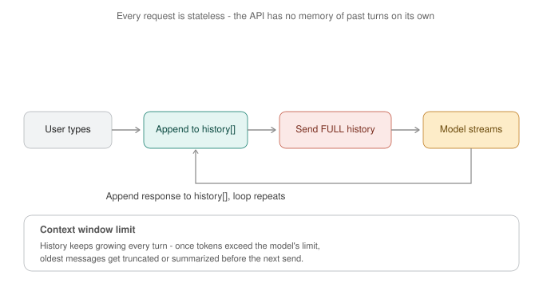

# Day 6 — Building Your First LLM App (No Framework)



*The model API is stateless — it has no memory of past turns on its own. Your app owns a growing `history[]` array, resends the whole thing every request, streams the response back, and appends it before looping. Once that history outgrows the context window, your code has to decide what to drop or summarize. Today you build every piece of this loop by hand, in plain Python, before ever touching a framework.*

**Goal for today:** ship a real, working CLI chatbot with conversation memory, streaming output, and context-window management — entirely in raw Python. This is deliberately the "no framework" day so that when you use LangChain later (Day 10), you know exactly what it's doing for you instead of trusting it blindly.

---

## Part A — Concepts (10 min read)

**The request/response loop is stateless, always:** every call to a model API is independent — it has no idea what you asked five seconds ago unless you tell it, every single time, by resending the full conversation. This is identical to a stateless HTTP API — the server doesn't remember your last request; if you want session behavior, *you* carry the session state and send it along. There is no hidden server-side memory to rely on (a few hosted APIs offer optional server-side conversation state as a convenience feature, but the underlying mechanism is the same — full history gets used somewhere, every time).

**Streaming:** instead of waiting for the full response and printing it all at once, the server sends the response in small chunks as they're generated, and your client renders each chunk as it arrives. This is exactly server-sent-events (SSE) style streaming you'd implement for any long-running API response — the model generates one token at a time internally regardless, streaming just exposes that instead of buffering it.

**Conversation memory:** just a list of `{"role": ..., "content": ...}` dicts, growing by two entries per turn (user message, then assistant reply). There's no special "memory" mechanism inside the model — the entire "memory" *is* this list, resent in full on every call. Understanding this demystifies a lot of "AI memory" marketing language — it's an array, not a brain.

**Context window management, the real engineering problem:** since you resend the full history every turn, and the model has a hard token limit, long conversations will eventually not fit. Common strategies, roughly in order of how much you'd reach for them:
1. **Sliding window** — drop the oldest messages once you're near the limit (simplest, loses old context entirely)
2. **Summarization** — periodically compress older turns into a shorter summary message, replacing them (keeps gist, costs an extra model call)
3. **Keep system prompt pinned, truncate the middle** — the system prompt usually matters most, drop from the oldest *user/assistant* turns first, never the system message

This is the same category of decision as log retention policy or cache eviction policy — you're deciding what to keep when you can't keep everything.

---

## Part B — Hands-On: Build It in Layers

### Step 1 — The simplest possible loop (no memory, no streaming)

Purpose: establish the absolute floor — one request, one response, nothing fancy — before adding any complexity.

```python
import ollama

def ask_once(question):
    response = ollama.chat(model="llama3.2", messages=[{"role": "user", "content": question}])
    return response["message"]["content"]

print(ask_once("What does a Kubernetes liveness probe do?"))
```
Run it twice with follow-up questions like "what about readiness probes then?" — notice the second call has zero idea what "then" refers to. That's the stateless nature from Part A, felt directly.

### Step 2 — Add conversation memory (the history array)

Purpose: this single list is the entire "memory" mechanism — nothing more exists under the hood.

```python
import ollama

history = []

def ask_with_memory(question):
    history.append({"role": "user", "content": question})
    response = ollama.chat(model="llama3.2", messages=history)
    reply = response["message"]["content"]
    history.append({"role": "assistant", "content": reply})
    return reply

print(ask_with_memory("What does a Kubernetes liveness probe do?"))
print(ask_with_memory("What about readiness probes then?"))
```
**What to notice:** the second answer now correctly relates "readiness probes" back to the liveness-probe discussion — because the *entire* prior exchange got resent as part of `history` on the second call. Print `history` after this and look at it — that list *is* the memory.

### Step 3 — Add streaming output

Purpose: real chat UX, and a look at how token-by-token generation actually surfaces through an API.

```python
import ollama

def ask_streaming(question, history):
    history.append({"role": "user", "content": question})
    full_reply = ""
    for chunk in ollama.chat(model="llama3.2", messages=history, stream=True):
        token = chunk["message"]["content"]
        print(token, end="", flush=True)
        full_reply += token
    print()
    history.append({"role": "assistant", "content": full_reply})
    return full_reply

history = []
ask_streaming("Explain what a sidecar container is, in 2 sentences.", history)
```
**What to notice:** `stream=True` turns the single response into an iterator of small chunks — you print each one immediately instead of waiting for the whole reply, but you still have to accumulate `full_reply` yourself to append the complete message back into history afterward. Streaming changes *display* timing, not what ultimately gets stored.

### Step 4 — Count tokens and detect when you're approaching the context limit

Purpose: turn "the context window might overflow" into a number you actually check, the same instinct as checking disk usage before it becomes an outage.

```python
import tiktoken

enc = tiktoken.get_encoding("cl100k_base")  # approximation - good enough for budgeting, not exact for every model

def count_history_tokens(history):
    total = 0
    for msg in history:
        total += len(enc.encode(msg["content"]))
    return total

MAX_CONTEXT_TOKENS = 4096
SAFETY_MARGIN = 512  # leave room for the model's response

def tokens_remaining(history):
    used = count_history_tokens(history)
    return MAX_CONTEXT_TOKENS - SAFETY_MARGIN - used

print(f"Tokens used so far: {count_history_tokens(history)}")
print(f"Tokens remaining before truncation needed: {tokens_remaining(history)}")
```

### Step 5 — Implement a real truncation strategy (sliding window, pinned system prompt)

Purpose: build the actual policy decision from Part A, not just detect the problem.

```python
def truncate_history(history, max_tokens=4096, safety_margin=512):
    system_msgs = [m for m in history if m["role"] == "system"]
    other_msgs = [m for m in history if m["role"] != "system"]

    budget = max_tokens - safety_margin - count_history_tokens(system_msgs)

    kept = []
    running_total = 0
    # walk backwards from the most recent message, keep what fits
    for msg in reversed(other_msgs):
        msg_tokens = len(enc.encode(msg["content"]))
        if running_total + msg_tokens > budget:
            break
        kept.insert(0, msg)
        running_total += msg_tokens

    dropped_count = len(other_msgs) - len(kept)
    if dropped_count > 0:
        print(f"[truncation] dropped {dropped_count} oldest message(s) to fit context window")

    return system_msgs + kept
```
**What this does:** always keeps the system prompt (your "config"), then keeps as many of the *most recent* messages as fit in the remaining budget, dropping the oldest first — exactly the sliding-window strategy from Part A, but with the system message correctly pinned instead of being at risk of getting dropped.

### Step 6 — Add session persistence (save/load conversation to disk)

Purpose: real chat apps survive restarts — this is the difference between a demo script and something you'd actually keep using.

```python
import json
from pathlib import Path

SESSION_FILE = Path("chat_session.json")

def save_session(history):
    SESSION_FILE.write_text(json.dumps(history, indent=2))

def load_session():
    if SESSION_FILE.exists():
        return json.loads(SESSION_FILE.read_text())
    return []
```

### Step 7 — Wire it all together: a real CLI chatbot

Purpose: this is today's actual deliverable — combine memory, streaming, truncation, and persistence into one runnable app.

```python
import ollama
import json
from pathlib import Path

SESSION_FILE = Path("chat_session.json")
SYSTEM_PROMPT = "You are a terse, practical DevOps assistant. Keep answers focused and actionable."

def load_session():
    if SESSION_FILE.exists():
        return json.loads(SESSION_FILE.read_text())
    return [{"role": "system", "content": SYSTEM_PROMPT}]

def save_session(history):
    SESSION_FILE.write_text(json.dumps(history, indent=2))

def chat_loop():
    history = load_session()
    print("DevOps CLI Assistant — type 'exit' to quit, 'reset' to clear memory\n")

    while True:
        user_input = input("You: ").strip()
        if user_input.lower() == "exit":
            save_session(history)
            print("Session saved. Bye!")
            break
        if user_input.lower() == "reset":
            history = [{"role": "system", "content": SYSTEM_PROMPT}]
            save_session(history)
            print("[history cleared]\n")
            continue
        if not user_input:
            continue

        history.append({"role": "user", "content": user_input})
        history = truncate_history(history)  # from Step 5

        print("Assistant: ", end="", flush=True)
        full_reply = ""
        for chunk in ollama.chat(model="llama3.2", messages=history, stream=True):
            token = chunk["message"]["content"]
            print(token, end="", flush=True)
            full_reply += token
        print("\n")

        history.append({"role": "assistant", "content": full_reply})
        save_session(history)

if __name__ == "__main__":
    chat_loop()
```
Save this as `chat.py` and run:
```bash
python3 chat.py
```
Have a real multi-turn conversation — ask something, then ask a follow-up that only makes sense with memory ("what about the other approach?"), then `exit` and re-run `python3 chat.py` — your conversation should resume exactly where you left off, because it was persisted to `chat_session.json`.

### Step 8 — Deliberately blow the context window and watch truncation kick in

Purpose: don't just trust the code — force the exact failure condition it was built to handle, and watch the log line fire.

```python
import ollama

history = [{"role": "system", "content": SYSTEM_PROMPT}]

# Simulate a long conversation by injecting many synthetic turns
for i in range(60):
    history.append({"role": "user", "content": f"Question {i}: explain concept number {i} about Kubernetes in detail with examples."})
    history.append({"role": "assistant", "content": f"Answer {i}: " + ("This is a detailed explanation. " * 40)})

print(f"Tokens before truncation: {count_history_tokens(history)}")
truncated = truncate_history(history, max_tokens=4096, safety_margin=512)
print(f"Tokens after truncation: {count_history_tokens(truncated)}")
print(f"Messages before: {len(history)}, after: {len(truncated)}")
print(f"System prompt still present: {truncated[0]['role'] == 'system'}")
```
**What to confirm:** the `[truncation] dropped N oldest message(s)` log fires, the final token count is under budget, and the system prompt survived at index 0 regardless of how much got dropped. This is the same validation instinct as testing an eviction policy under load instead of assuming it works.

---

## Deliverable

Your working `chat.py` **is** today's deliverable — a real, persistent, streaming, context-aware CLI chatbot. Additionally save `~/ai-course/day6-notes.md`:

```markdown
# Day 6 Notes

## What "memory" actually is
- One sentence, in my own words: ...

## Streaming
- What changes with stream=True, and what doesn't: ...

## Context management
- Tokens used before/after my Step 8 truncation test: ...
- Which strategy did I implement (sliding window / summarization / other): ...

## Session persistence
- Confirmed conversation resumed correctly after restart: yes/no
```

---

**Tomorrow (Day 7):** checkpoint + catch-up day — review gaps from Days 1-6, skim the conceptual gist of "Attention Is All You Need," and write a personal glossary of every term learned so far before moving into Week 2's applied work.
